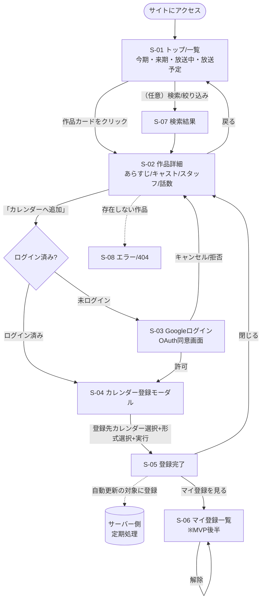
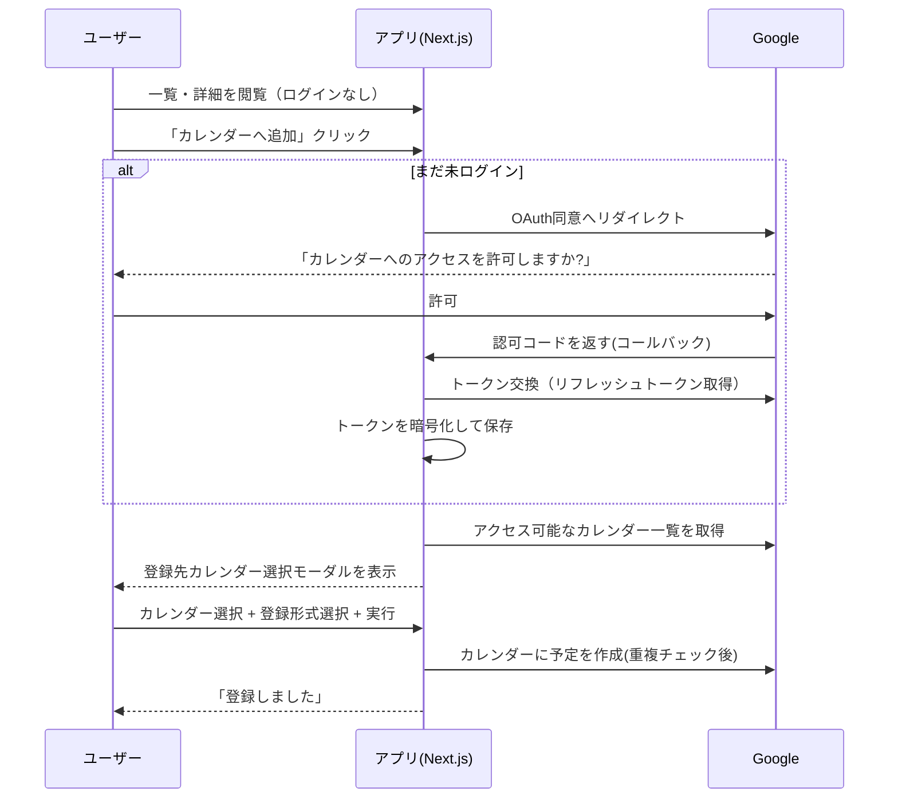
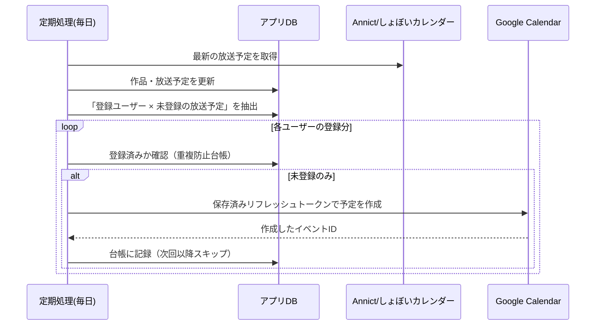

# 03. 画面遷移図

「ユーザーがどの画面からどの画面へ移動するか」を図で示します。
（図は Mermaid 記法。GitHubやVS Codeのプレビューで図として表示されます）

## 全体の流れ

## ログインの起きるタイミング（重要）

ログインは **「カレンダーへ追加」ボタンを押した瞬間だけ** 発生します。それ以外（一覧・詳細の閲覧）は一切ログイン不要です。

## 自動更新の流れ（ユーザー操作の外で動く）

ユーザーが登録した後は、本人がPCを開いていなくてもサーバーが動きます。

詳細な仕組みは [08_自動更新方式.md](08_自動更新方式.md) を参照。
