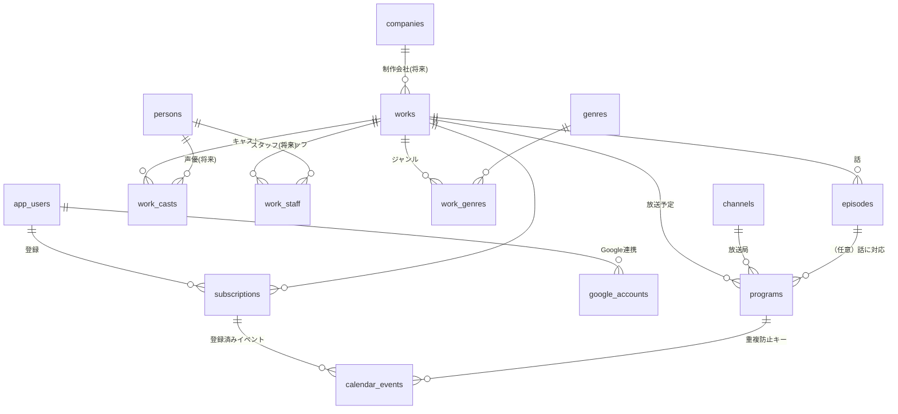
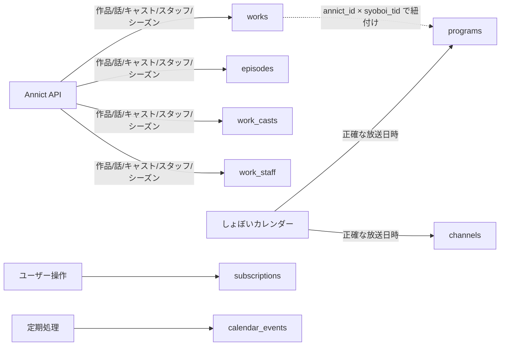

# 04. DB設計

データベースは **PostgreSQL（Supabase）** を使います。

## 設計の考え方（非エンジニア向け）

- データは「表（テーブル）」に分けて保存します。1つの表は1種類の情報（例: 作品の表、放送予定の表）。
- 表と表は「ID」でつながります（例: 放送予定の表は「どの作品か」を作品IDで指す）。
- 将来「声優ページ」「制作会社ページ」を追加できるよう、**人物・会社は最初から別テーブルに切り出せる構造**にしておきます（MVPでは簡易版でも可）。

## テーブル全体図（ER図）

---

## A. コンテンツ系テーブル（アニメ情報）

### works（作品）
| カラム | 型 | 説明 |
|--------|-----|------|
| id | uuid (PK) | アプリ内部ID |
| annict_id | bigint (unique, null可) | Annict側の作品ID（突合・再取得用） |
| syoboi_tid | integer (null可) | しょぼいカレンダーの作品ID（放送予定の紐付け用） |
| title | text | タイトル |
| title_kana | text (null可) | 読み（ソート・検索用） |
| title_en | text (null可) | 英題 |
| synopsis | text (null可) | あらすじ |
| official_site_url | text (null可) | 公式サイト |
| media | text (null可) | 種別: `tv` / `movie` / `ova` / `web` など |
| season_year | integer (null可) | 放送年（例: 2026） |
| season_name | text (null可) | `winter`/`spring`/`summer`/`autumn` |
| status | text | 放送状況: `upcoming`(放送予定) / `airing`(放送中) / `finished`(終了) |
| key_visual_url | text (null可) | キービジュアル画像URL |
| company_id | uuid (FK→companies, null可) | 主要制作会社（将来用。MVPでは未使用でも可） |
| source_updated_at | timestamptz (null可) | 元データの最終更新（差分取得用） |
| created_at / updated_at | timestamptz | 作成・更新日時 |

> **MVPの簡略化**: `company_id` は使わず、制作会社名は後述 `work_staff` の「アニメーション制作」行に文字列で入れてもよい。

### episodes（エピソード）
| カラム | 型 | 説明 |
|--------|-----|------|
| id | uuid (PK) | |
| work_id | uuid (FK→works) | どの作品か |
| number | numeric (null可) | 話数（12.5話などに備え数値） |
| number_text | text (null可) | 表示用話数（"第1話" "#1"） |
| title | text (null可) | サブタイトル（**マージ後の採用値**。下記ルールで決定） |
| title_source | text (null可) | サブタイトルの取得元: `annict` / `syoboi` / `manual` |
| sort | integer | 並び順 |
| annict_episode_id | bigint (null可) | Annict側エピソードID |
| created_at / updated_at | timestamptz | |

> **サブタイトルのマージ・解決ルール（重要）**
> サブタイトルは Annict と しょぼいカレンダー の **どちらか片方にしか無い**ことがある。取り込み時に両方を見て、次の優先順で `title` を埋める:
> 1. 片方にしか無ければ **それを採用**（`title_source` に取得元を記録）
> 2. 両方にあれば優先元（既定: Annict）を採用。空文字は「無し」扱い
> 3. 両方とも無ければ `null`（= サブタイトル無しでも後続処理は止めない）
>
> 後の取り込みで「これまで無かった側にサブタイトルが追加」された場合は `title` を更新し、それを使っている `calendar_events` をカレンダー更新の対象にする（[07](07_GoogleカレンダーAPI連携設計.md) / [08](08_自動更新方式.md)）。

### channels（放送局）
| カラム | 型 | 説明 |
|--------|-----|------|
| id | uuid (PK) | |
| name | text | 放送局名（例: TOKYO MX） |
| syoboi_chid | integer (unique, null可) | しょぼいカレンダーのチャンネルID |

### programs（放送予定 / 番組）★カレンダー登録の核
| カラム | 型 | 説明 |
|--------|-----|------|
| id | uuid (PK) | |
| work_id | uuid (FK→works) | 作品 |
| episode_id | uuid (FK→episodes, null可) | 対応する話（分かれば） |
| channel_id | uuid (FK→channels, null可) | 放送局 |
| count | numeric (null可) | 放送話数 |
| start_at | timestamptz | **放送開始日時（最重要）** |
| end_at | timestamptz (null可) | 放送終了日時 |
| is_rebroadcast | boolean | 再放送か |
| syoboi_pid | integer (unique, null可) | しょぼいカレンダーの番組ID（**重複取得防止**） |
| created_at / updated_at | timestamptz | |

> `syoboi_pid` に unique を付けることで、同じ放送回を二重に取り込むことを**データ取得段階で**防ぐ。

### genres / work_genres（ジャンル：多対多）
- `genres(id, name)`
- `work_genres(work_id, genre_id)` … 1作品に複数ジャンル、1ジャンルに複数作品。

### work_casts（キャスト）
| カラム | 型 | 説明 |
|--------|-----|------|
| id | uuid (PK) | |
| work_id | uuid (FK→works) | |
| character_name | text | キャラ名（例: フリーレン） |
| person_id | uuid (FK→persons, null可) | 声優（将来用） |
| person_name | text | 声優名（例: 種﨑敦美）。MVPは文字列で持つ |
| sort | integer | 並び順 |

### work_staff（スタッフ）
| カラム | 型 | 説明 |
|--------|-----|------|
| id | uuid (PK) | |
| work_id | uuid (FK→works) | |
| role | text | 役割（監督 / シリーズ構成 / キャラクターデザイン / 音楽 / アニメーション制作 …） |
| person_id | uuid (FK→persons, null可) | 将来用 |
| person_name | text | 担当者名 or 会社名 |
| sort | integer | 並び順 |

### persons（人物：声優・スタッフ）※将来拡張の受け皿
- `persons(id, name, name_kana, annict_person_id, profile, image_url, ...)`
- MVPでは作らなくてもよいが、`work_casts.person_name` を後から `person_id` に正規化できるようにしておく。

### companies（制作会社）※将来拡張の受け皿
- `companies(id, name, annict_org_id, ...)`

> **将来拡張のコツ**: MVPは「名前を文字列で持つ」→ 拡張時に「人物/会社テーブルへ正規化し、IDで紐付け」へ移行。最初からカラム（person_id / company_id）だけ用意しておけば移行がスムーズ。

---

## B. ユーザー・連携系テーブル

### app_users（利用者）
| カラム | 型 | 説明 |
|--------|-----|------|
| id | uuid (PK) | Supabase Authのユーザーと対応 |
| email | text | Googleアカウントのメール |
| display_name | text (null可) | 表示名 |
| created_at | timestamptz | 初回ログイン日時 |

> Supabase Authを使う場合、認証ユーザーは `auth.users` に入る。`app_users` は補足プロフィールとして紐付け（id を共有）。

### google_accounts（Google連携情報）★セキュリティ重要
| カラム | 型 | 説明 |
|--------|-----|------|
| id | uuid (PK) | |
| user_id | uuid (FK→app_users) | |
| google_sub | text (unique) | Googleの一意ユーザー識別子 |
| refresh_token_encrypted | text | **暗号化した**リフレッシュトークン（PC不在時もカレンダー操作する合鍵） |
| scopes | text[] | 許可されたアクセス範囲 |
| token_updated_at | timestamptz | |

> リフレッシュトークンは平文で保存しない。サーバー側でのみ復号（[06](06_GoogleOAuth設計.md)）。

### subscriptions（登録：ユーザーが追跡する作品）
| カラム | 型 | 説明 |
|--------|-----|------|
| id | uuid (PK) | |
| user_id | uuid (FK→app_users) | |
| work_id | uuid (FK→works) | 追跡対象の作品 |
| google_calendar_id | text | 登録先カレンダー（GoogleのカレンダーID） |
| mode | text | `per_episode`(話単位) / `whole`(作品単位) |
| include_subtitle / include_channel / include_url | boolean | 説明欄に含める項目 |
| auto_sync | boolean | 自動更新の対象とするか（既定true） |
| status | text | `active` / `paused` / `cancelled` |
| created_at / updated_at | timestamptz | |
| **制約** | unique(user_id, work_id, google_calendar_id) | 同一作品×同一カレンダーの二重登録防止 |

### calendar_events（登録済みイベント台帳）★重複防止の核
| カラム | 型 | 説明 |
|--------|-----|------|
| id | uuid (PK) | |
| subscription_id | uuid (FK→subscriptions) | |
| program_id | uuid (FK→programs) | どの放送回を登録したか |
| google_calendar_id | text | 登録先カレンダー |
| google_event_id | text | Google側のイベントID（更新・削除に使用） |
| status | text | `created` / `updated` / `deleted` / `failed` |
| content_hash | text (null可) | 登録時のイベント内容（タイトル+サブタイトル+開始時刻+放送局）のハッシュ。**差分検知用** |
| synced_at | timestamptz | 最終同期日時 |
| **制約** | unique(subscription_id, program_id) | **同じ予定を二重登録させない最重要制約** |

> 自動更新は「`subscriptions` × `programs`」を突き合わせ、`calendar_events` に無い組み合わせだけ登録する。これで重複が原理的に発生しない。

### sync_runs（同期ジョブ実行ログ）※運用・デバッグ用
- `sync_runs(id, started_at, finished_at, status, created_count, error_count, note)`
- 定期処理が「いつ・何件登録したか」を残す。失敗調査に使う。

---

## C. データの流れ（どこから埋まるか）

## D. インデックス・パフォーマンス指針（軽め）
- `works(season_year, season_name, status)` … 一覧タブの絞り込み用。
- `programs(start_at)`, `programs(work_id)` … 直近の放送予定検索用。
- `calendar_events(subscription_id, program_id)` unique … 重複防止＆高速判定。
- 身内規模ではこの程度で十分。大規模化時に見直す。

## E. アクセス制御（Supabase RLS）
- `works / episodes / programs / casts / staff / genres` … **誰でも読み取り可**（閲覧はログイン不要のため）。書き込みはサーバー（service role）のみ。
- `app_users / google_accounts / subscriptions / calendar_events` … **本人のみ** 読み書き可（Row Level Security で `user_id = auth.uid()`）。`google_accounts` の `refresh_token_encrypted` は通常APIでは返さず、サーバー処理内でのみ扱う。
