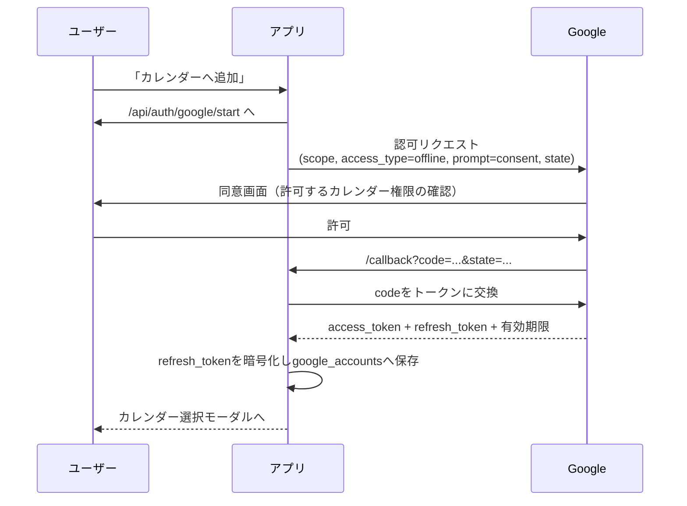

# 06. Google OAuth設計

## OAuthとは（30秒で）
ユーザーのGoogleパスワードを預からずに、「このアプリにカレンダーの読み書きを許可する」とユーザー自身がGoogle上で同意する仕組み。同意すると、アプリは「アクセストークン（短命）」と「リフレッシュトークン（長命の合鍵）」を受け取れる。

## このアプリでの方針
- **ログインは「カレンダーへ追加」ボタンを押した時だけ**発生（閲覧は完全に認証不要）。
- **offline access** を要求して **リフレッシュトークン** を取得する。
  → これがあると、ユーザーがPCを閉じていてもサーバーが代理でカレンダー操作できる（=自動更新の前提）。

## 必要なスコープ（最小限）

| スコープ | 用途 | 種類 |
|----------|------|------|
| `openid`, `email`, `profile` | 誰のアカウントか識別 | 機微度 低 |
| `https://www.googleapis.com/auth/calendar.calendarlist.readonly` | アクセス可能なカレンダー一覧の取得 | – |
| `https://www.googleapis.com/auth/calendar.events` | イベントの作成・更新・削除 | 機微度 中（要審査の可能性） |

> `calendar.events` は「自分が作ったイベントのみ」を扱える範囲に近く、`calendar`（全イベント読み書き）より安全。まずはこれで設計。

## 認可フロー（認可コードフロー）

ポイント:
- `access_type=offline` … リフレッシュトークンを得るために必須。
- `prompt=consent` … 初回や再同意でリフレッシュトークンを確実に受け取るため（Googleは2回目以降refresh_tokenを返さないことがある）。
- `state` … CSRF（なりすまし）対策のランダム値。コールバックで照合。

## トークン管理

| トークン | 寿命 | 保存場所 | 用途 |
|----------|------|----------|------|
| アクセストークン | 約1時間 | 都度発行（DBに長期保存しない） | API呼び出し |
| リフレッシュトークン | 長期 | `google_accounts.refresh_token_encrypted`（**暗号化**） | アクセストークンの再発行 |

### セキュリティ要件（必須）
1. リフレッシュトークンは **暗号化して保存**（Supabase Vault もしくはサーバー保持の鍵でAES暗号化）。平文保存しない。
2. 復号と利用は **サーバー側のみ**。ブラウザ（クライアント）には絶対に渡さない。
3. `google_accounts` テーブルはRLSで本人のみ、トークン列は通常のAPIレスポンスに含めない。
4. トークン失効（ユーザーが許可取消・期限切れ）時は `subscriptions` を `paused` にし、次回ログイン時に再同意を促す。
5. クライアントシークレット等は環境変数（Vercel/Supabaseのシークレット）で管理。リポジトリに置かない。

## Google Cloud側の準備（運用メモ）
- Google Cloud Console で OAuth 同意画面とクライアントIDを作成。
- リダイレクトURI: `https://<本番ドメイン>/api/auth/google/callback`（ローカル用も登録）。
- **公開ステータス**:
  - 「テスト」段階は登録した**テストユーザー（最大100人）**のみ利用可 → **身内・会社利用ならこれで十分**な場合が多い。
  - 一般公開する場合、`calendar.events` 等の機微スコープは **Googleの審査** が必要になることがある。身内運用なら審査を避けられる可能性が高い。
- まず「内部利用（テストユーザー）」で始め、必要になったら公開申請、という段階運用を推奨。
