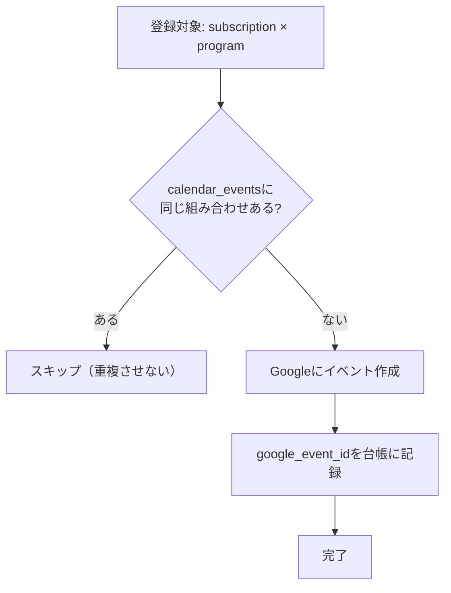

# 07. Googleカレンダー連携設計

## 1. カレンダー一覧の取得
- API: `GET /calendar/v3/users/me/calendarList`
- 取得できるもの: ユーザーがアクセスできる各カレンダー（個人 / 会社共有 / プロジェクト用）。各カレンダーには `id`（例 `xxx@group.calendar.google.com`）と `summary`（表示名）、`accessRole`（権限）がある。
- **登録に使えるのは `accessRole` が `writer` か `owner` のカレンダーのみ** → 選択UIではそれ以外を選べない（または警告）ようにする。

## 2. 登録するイベントの形（要件どおり）

### タイトル
| モード | 形式 | 例 |
|--------|------|-----|
| 話単位 `per_episode` | `【アニメ】作品名 第○話` | `【アニメ】葬送のフリーレン 第12話` |
| 作品単位 `whole` | `【アニメ】作品名` | `【アニメ】葬送のフリーレン` |

### 日時
- `start` / `end` … `programs.start_at` / `end_at`（しょぼいカレンダー由来の正確な時刻）。
- `end_at` が無ければ開始から30分後を仮設定（多くのTVアニメは30分枠）。
- タイムゾーンは `Asia/Tokyo` を明示。

### 説明欄（description, 取得できた範囲で）
```
サブタイトル: 旅の終わり
放送局: TOKYO MX
作品ページ: https://<このアプリ>/works/<id>
（このイベントは アニメDB により自動登録されました）
```

> **サブタイトルが片方のソースにしか無い／まだ無い場合**
> - サブタイトルは Annict・しょぼいカレンダー の **どちらか片方にしか無い**ことがある。`episodes.title`（マージ後の値, [04](04_DB設計.md)）が入っていればタイトル/説明欄に使い、**無ければサブタイトル行を省いてそのまま登録する**（サブタイトル欠如は登録のブロック条件にしない）。
> - 後の取り込みでサブタイトルが判明したら、該当イベントを**更新**して反映する（下記「4. 変更・削除への対応」）。話単位タイトルも `…第○話: サブタイトル` のように埋め直す。

### イベント作成リクエスト例
```json
POST /calendar/v3/calendars/{calendarId}/events
{
  "summary": "【アニメ】葬送のフリーレン 第12話",
  "description": "サブタイトル: ...\n放送局: TOKYO MX\n作品ページ: https://.../works/xxx",
  "start": { "dateTime": "2026-04-05T23:00:00+09:00", "timeZone": "Asia/Tokyo" },
  "end":   { "dateTime": "2026-04-05T23:30:00+09:00", "timeZone": "Asia/Tokyo" },
  "extendedProperties": {
    "private": {
      "app": "anime-db",
      "subscriptionId": "<uuid>",
      "programId": "<uuid>",
      "syoboiPid": "123456"
    }
  }
}
```

## 3. 重複防止（最重要）

「同じ放送予定が複数回登録されない」を **二重の仕組み** で担保する。

### 仕組み① アプリDBの台帳（主たる防御）
- `calendar_events` テーブルに `unique(subscription_id, program_id)` 制約。
- 登録前に必ず「この登録(subscription)で、この放送回(program)を既に作ったか？」を確認 → 無い場合だけ作成 → 作成後に台帳へ記録。
- これにより、定期処理が何度走っても同じ予定は1回しか作られない（=冪等）。

### 仕組み② Google側のマーキング（補助・自己修復）
- 作成イベントに `extendedProperties.private`（`programId`, `syoboiPid` など）を付与。
- 台帳とGoogleがズレた場合（例: 台帳消失、手動削除）、`programId` で検索して照合・復旧できる。



## 4. 変更・削除への対応
- 同期ジョブは、登録済みイベントごとに「**今あるべき内容**」を組み立て、`content_hash`（タイトル＋サブタイトル＋開始時刻＋放送局）を計算する。台帳の `content_hash` と違えば `PATCH`（イベント更新）し、ハッシュを更新する。これにより以下が**自動で**反映される:
  - 放送時間が変わった（`programs.start_at` 変化）
  - **サブタイトルが後から判明した／片方のソースにだけ追加された**（`episodes.title` が `null`→値、または値が変化）
  - 放送局名などの変更
- 変更が無ければ `PATCH` を送らない（Google API呼び出しを節約）。
- ユーザーが登録解除（`DELETE /api/subscriptions/{id}`）:
  - オプションで、台帳にある `google_event_id` を `DELETE`（カレンダーからも削除）。
  - 「カレンダーからは消さず追跡だけ止める」も選べるようにすると親切。

## 5. レート制限・失敗時
- Googleには利用上限がある。**1件ずつ作成し、失敗は記録して次回再試行**（`calendar_events.status=failed`）。
- 429/5xx は指数バックオフで控えめにリトライ。身内規模なら上限超過はまず起きない。

## 6. 即時登録 vs 自動登録の役割分担
- ユーザーが「追加」を押した瞬間: **既知の未来の放送回**をその場で登録（体験を良くする）。
- それ以降に判明する新しい放送回: **自動更新**が拾って追加（[08](08_自動更新方式.md)）。
- どちらも同じ重複防止ロジックを通るので、二重登録は起きない。
