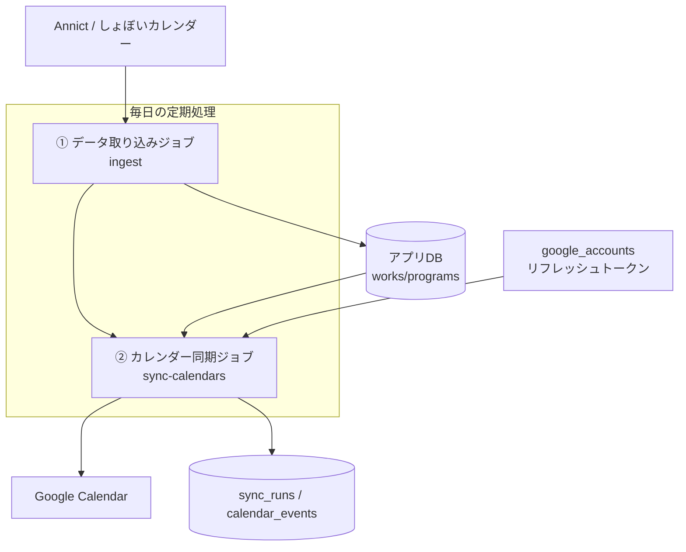

# 08. 自動更新方式

## 要件
ユーザーが作品を登録した後は、**本人がPCを起動していなくても**、定期的に放送予定を取得してGoogleカレンダーへ追加する。重複は作らない。

→ これは「ユーザーのブラウザ」ではなく「**サーバー上で定期的に動く処理**」が必要。これを実現するのが **cron（定期実行）** と、本人の代わりに動くための **リフレッシュトークン**。

## 全体構成

## 2つのジョブ

### ① データ取り込みジョブ（ingest）
- 頻度: **1日1〜2回**（例: 毎朝6時、夕方18時）。
- 内容:
  1. Annictから対象シーズンの作品・話・キャスト・スタッフを取得 → `works/episodes/...` を更新。
  2. しょぼいカレンダーから対象作品（`syoboi_tid`）の放送予定を取得 → `programs` を更新（`syoboi_pid` で重複取り込み防止）。
  3. 放送状況 `status`（upcoming/airing/finished）を日付に基づき更新。
- 取り込み対象は「今シーズン＋来シーズン＋登録ユーザーがいる作品」に絞ると効率的。

### ② カレンダー同期ジョブ（sync-calendars）
- 頻度: **1日1回**（ingestの後）。直近の予定変更に追従したいなら頻度を上げてもよい。
- 内容（ユーザーごと・登録ごと）:
  1. `subscriptions`（status=active, auto_sync=true）を列挙。
  2. 各登録について、対象作品の **未来の `programs`** を取得。
  3. 各 `program` を「新規登録」と「既存更新」に振り分ける:
     - `calendar_events` に無い → **新規作成**（重複防止）。
     - 既にある → 「今あるべき内容」の `content_hash`（タイトル＋**サブタイトル**＋開始時刻＋放送局）を台帳の値と比較し、**違えば更新（PATCH）**。同じなら何もしない。
       - ※ これにより、**サブタイトルが片方のソースにしか無かった／後から判明した**ケースも、次回同期で自動的にカレンダーへ反映される。サブタイトルが無くても登録自体は止めない。
  4. `google_accounts` のリフレッシュトークンでアクセストークンを再発行 → イベント作成 or 更新。
  5. 結果を `calendar_events` に記録（`content_hash` も更新）。失敗は `status=failed` にして次回再試行。
  6. ジョブ全体の集計を `sync_runs` に記録。

## どこで動かすか（cronの選択肢）

| 方式 | 説明 | 向き |
|------|------|------|
| **Supabase Cron（pg_cron）+ Edge Functions** | DBに同梱の定期実行。DBに近く、トークン保管(Supabase)とも相性良い | **推奨**（本構成のデータ基盤がSupabaseのため一体運用しやすい） |
| **Vercel Cron Jobs** | Vercelが定期的に指定URL(`/api/internal/...`)を叩く。設定が簡単 | 次点。アプリと同じNext.js内で完結 |
| 外部cron（GitHub Actions等） | 無料枠で定期実行しURLを叩く | 代替案 |

> どれを選んでも「内部APIエンドポイントをcronが叩く」形にしておけば、後から乗り換え可能。エンドポイントはシークレットで保護。

## 「PCを切っていても動く」理由（非エンジニア向け）
- ユーザーが一度「許可」すると、サーバーは **リフレッシュトークン（合鍵）** を保管する。
- 定期処理はその合鍵で「ユーザー本人の代理」としてGoogleカレンダーに書き込める。
- だから **ユーザーのPC・ブラウザは一切関係ない**。サーバーだけで完結する。

## 信頼性のための設計
- **冪等性**: 何度実行しても重複が出ない（台帳＋unique制約）。途中で落ちても再実行で安全に続行。
- **部分失敗に強い**: 1ユーザー/1件の失敗で全体を止めない。失敗分だけ次回拾う。
- **ログ**: `sync_runs` に実行ごとの件数・エラー数を残し、問題を追える。
- **取りこぼし防止**: 「直近N日先までの未来予定」を毎回チェックするので、前回失敗分も自然に再登録される。

## 将来の拡張ポイント（予告）
- 放送延期・時間変更の **通知**（メール/Discord/Slack）は、②の同期時に「`programs.start_at` が変わった」を検知して通知を送る形で追加可能（[10](10_アーキテクチャ設計.md)）。
