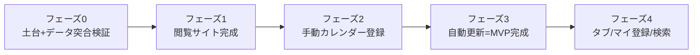

# 09. MVP範囲と優先順位

MVP = Minimum Viable Product（実用になる最小限のもの）。「全部入り」ではなく、**価値が出る最小構成**をまず作って動かし、検証してから広げます。

## このアプリの「価値の核」
> 放送予定を一覧で見て、見たい作品をGoogleカレンダーに登録 → あとは自動で放送回が追加される。

これが成立すれば最小成功。**逆に言うと、まずここだけに集中する。**

## MVPに入れる / 入れない

### ✅ MVPに入れる
- 今シーズンのアニメ一覧（タイトル/キービジュアル/放送時期/状況/ジャンル）
- 作品詳細（あらすじ/公式サイト/放送情報/エピソード/キャスト/スタッフ）
- 「Googleカレンダーへ追加」（追加時のみGoogleログイン）
- カレンダー一覧取得 → 登録先選択 → 登録（作品単位/話単位）
- 直近放送回の即時登録
- 自動更新（1日1回の同期）＋重複防止
- データ取り込みバッチ（Annict＋しょぼいカレンダー）

### ⏳ MVPの後半 or 次フェーズ
- 来シーズン/放送中/放送予定の **タブ切り替え**（最初は今シーズン1枚でも可）
- マイ登録一覧・登録解除（S-06）
- 検索・ジャンル絞り込み（S-07）
- 説明欄カスタム項目の細かい設定

### ❌ MVPに入れない（将来）
- 声優/スタッフ/制作会社ページ、ランキング、お気に入り、社内おすすめ、各種通知
- （ただしDB設計は拡張可能にしてある → [10](10_アーキテクチャ設計.md)）

---

## 実装の優先順位（フェーズ順）

### フェーズ0: 土台づくり（最優先）
| 優先 | やること | なぜ最初か |
|------|----------|------------|
| 1 | プロジェクト雛形（Next.js+TS）＋Supabase接続 | 全ての土台 |
| 2 | DBテーブル作成（works/episodes/programs/casts/staff/channels/genres） | データの器がないと何も始まらない |
| 3 | **データ取り込みの検証**: Annictで今期作品取得 → しょぼいカレンダーと突合 | **ここが最大の技術リスク**。早期に確かめる |

> ⚠️ **フェーズ0の③が最重要のリスク検証。** AnnictとしょぼいカレンダーがちゃんとTID/scPidで紐付くか、今シーズンの数作品で先に確認する。ここが崩れると全体が崩れるため、デザインより先に検証する。

### フェーズ1: 閲覧体験（ログイン不要部分を完成）
| 優先 | やること |
|------|----------|
| 4 | 一覧画面（S-01）：今シーズン作品をカード表示 |
| 5 | 作品詳細画面（S-02）：あらすじ・話・キャスト・スタッフ・放送情報 |
| 6 | 取り込みバッチを定期実行化（毎日更新） |

→ ここまでで「Annict風の閲覧サイト」として成立。ログイン不要なので身内に見せてフィードバックを得られる。

### フェーズ2: カレンダー連携（価値の核）
| 優先 | やること |
|------|----------|
| 7 | Google OAuth（追加ボタン時のみ）＋リフレッシュトークン暗号化保存 |
| 8 | カレンダー一覧取得 → 登録先選択モーダル（S-04） |
| 9 | 登録実行＋**重複防止台帳**（calendar_events）＋直近放送回の即時登録 |

→ ここで「見たい作品をカレンダー登録」までが手動で完成。

### フェーズ3: 自動化（要件の肝）
| 優先 | やること |
|------|----------|
| 10 | 同期ジョブ（sync-calendars）をcron化：未登録の放送回を自動追加 |
| 11 | 失敗リトライ・ログ（sync_runs）・トークン失効ハンドリング |

→ 「PCを切っていても自動で追加される」が完成。**MVP達成。**

### フェーズ4: 仕上げ（MVP後半）
| 優先 | やること |
|------|----------|
| 12 | タブ（来期/放送中/放送予定）切り替え |
| 13 | マイ登録一覧・解除（S-06） |
| 14 | 検索・ジャンル絞り込み（S-07） |

---

## マイルストーン目安

| 区切り | 確認できること |
|--------|----------------|
| フェーズ1完了 | 身内が「今期アニメ一覧サイト」として使える |
| フェーズ2完了 | 手動でカレンダー登録できる |
| **フェーズ3完了** | **自動追加まで動く = リリース可能なMVP** |

## MVPでの割り切り（迷ったらこうする）
- タブは最初「今シーズン」1枚でOK（来期/放送中は後で）。
- 声優/スタッフは **文字列表示のみ**（リンクなし）。
- エラーは丁寧に作り込まず、まず動かす。
- 対象作品はまず「今シーズン全部」or「主要数十作」に限定し、突合精度を見ながら広げる。
- 突合できない作品は **管理者が手で `syoboi_tid` を補正** できる最小手段を用意（裏側でDB直編集でも可）。

---

## 次の一歩（おすすめ）
1. この設計でOKか確認 → 修正点を反映。
2. フェーズ0③（**Annict×しょぼいカレンダーの突合検証**）を小さく実装して、データが正しく繋がるか先に確かめる。
3. 問題なければフェーズ1（閲覧サイト）から実装着手。

> ご希望があれば、次は「フェーズ0の検証用スクリプト」または「DBの実テーブル定義(SQL)」から実装を始められます。
